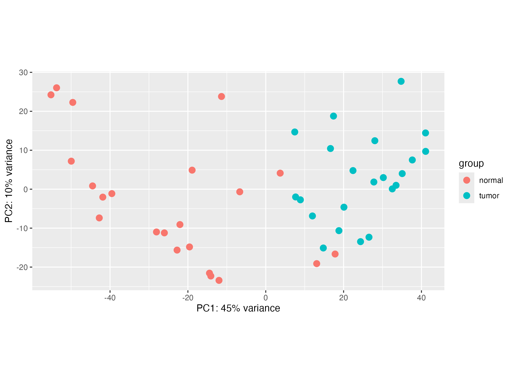
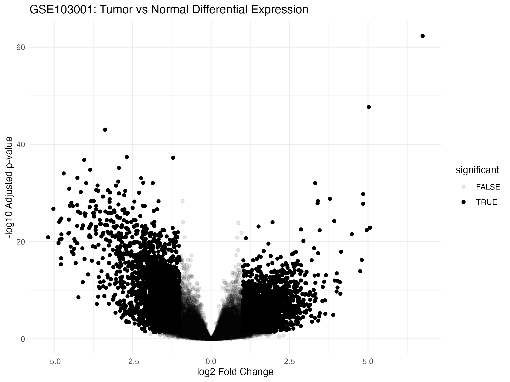
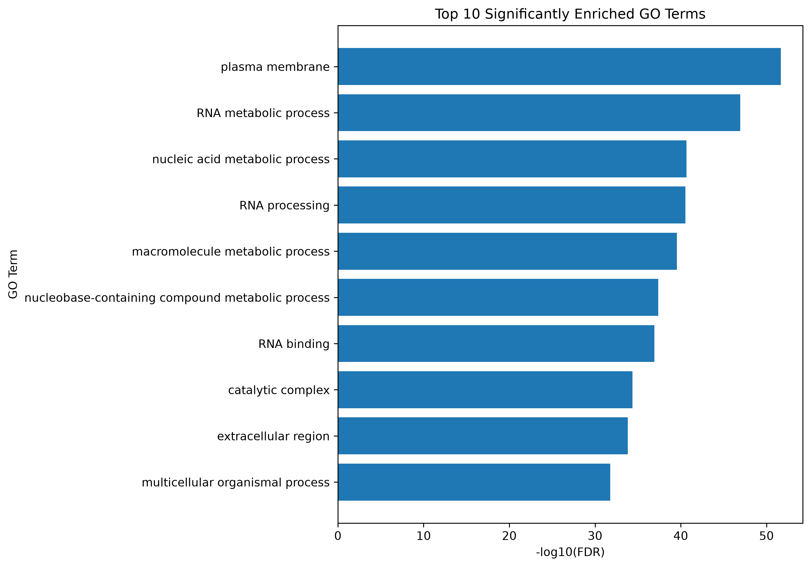
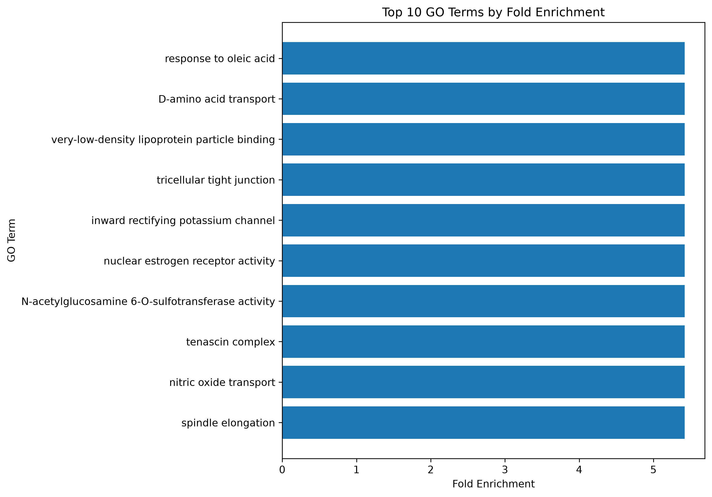
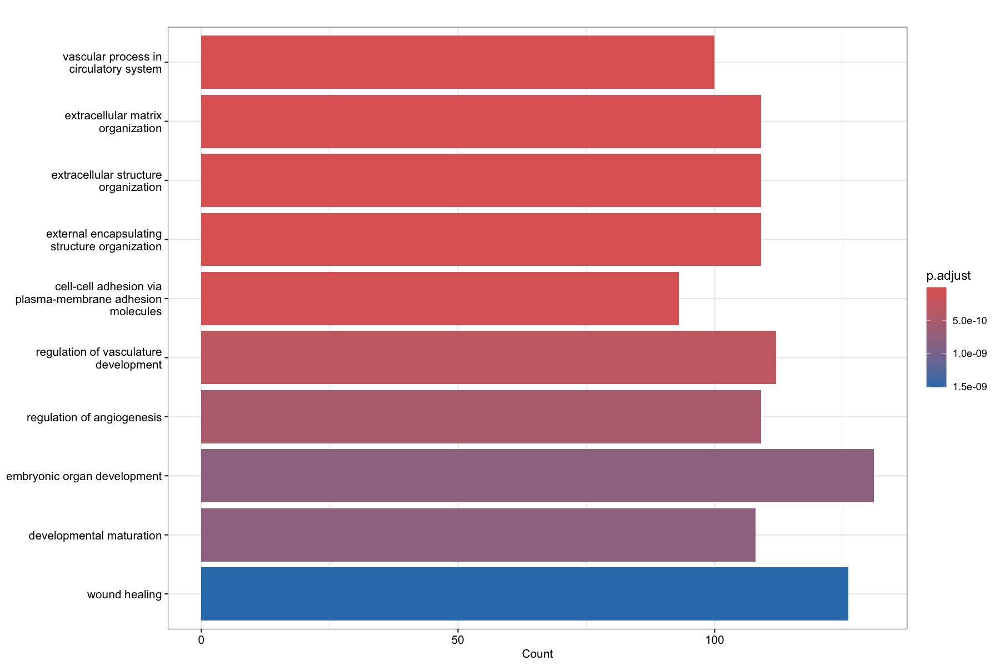
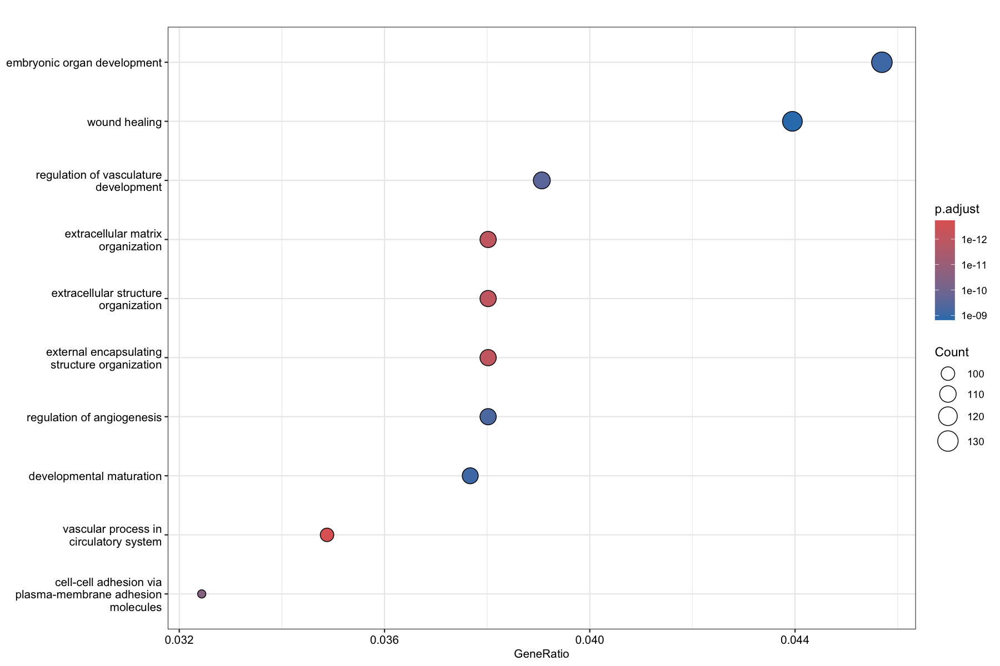
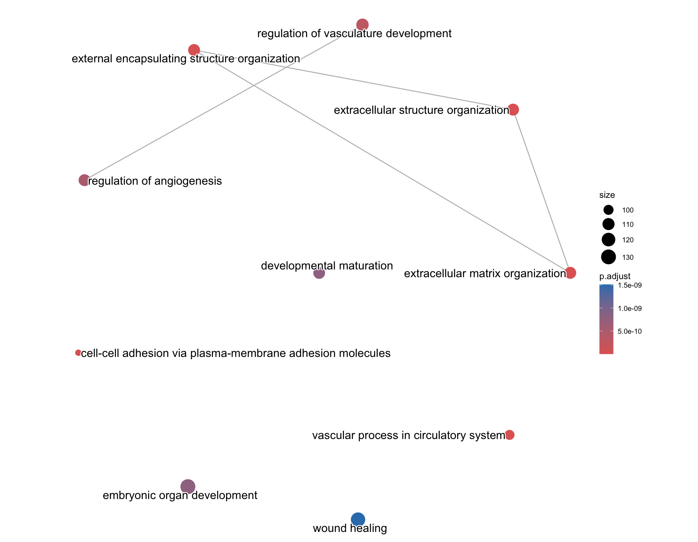
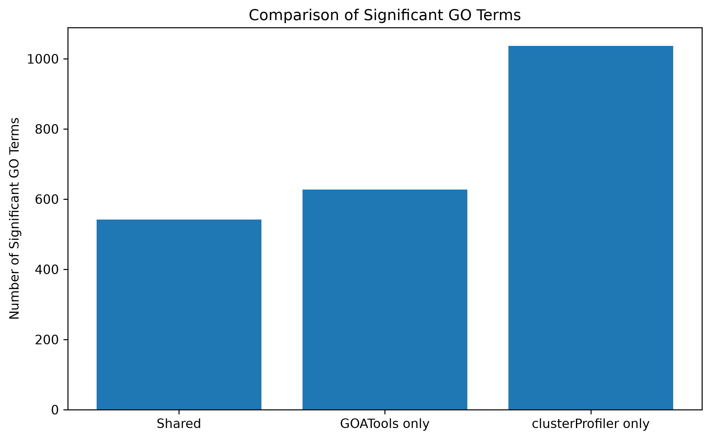

# Gene Ontology Enrichment Analysis  

Bioinformatics workflow for **RNA-seq differential-expression analysis, Gene Ontology enrichment, visualization, and cross validation** using languages Python & R.

This project & its design focuses on the answering a practical functional-genomics question:

> How can differentially expressed genes be translated into easily-interpretable biological processes, and how consistent are these results across different GO enrichment frameworks?

The workflow was first designed & validated using a small demonstrational gene set and then was applied to **GSE103001**, a real paired RNA-seq dataset, using DESeq2, GOATOOLS, & clusterProfiler.

_____

## Project Highlights
- Built a RNA-seq to GO enrichment workflow; reusable
- 44 HT-Seq RNA-seq count files were processed
- Modeled the paired tumor & normal samples using DESeq2
- 4,545 significantly differentially expressed genes were identified
- To proceed with downstream annotation, Ensembl gene IDs were converted to Entrez IDs
- Created a background gene population, specific to the experiment
- Performed GO enrichment, independently with GOATOOLS (Python) & clusterProfiler (R)
- Generated PCA, volcano, enrichment, dot, bar, and network visualizations
- Compared GO results across frameworks
- Organized the outputs into reproducible demo & real-data workflows

_____

## 1. Project Overview

Although RNA-seq differential-expression analysis can identify the thousands of genes that differ between biological conditions, the individual interpretation of these genes do not allow for the understanding of the biological systems that underly those changes.

Gene Ontology Enrichment Analysis aids in fixing this problem, by testing whether specific biological functions are disproportionately represented among a selected gene set relative to a background population.

The workflow that this project implements is as follows:

```text
RAW RNA-seq counts ->
Count Matrix construction ->
Sample metadata ->
Paired DESeq2 analysis ->
Differentially expressed genes ->
ENSEMBL to ENTREZID conversion ->
Study + background gene sets ->
GO Enrichment via GOATOOLS (python) & clusterProfiler (R) ->
Cross-tool comparison across frameworks ->
Biological interpretation
```

_____

## 2. Pipeline Validation via Demo

Before applying the workflow to a full-sized RNA-seq dataset, the GO enrichment pipeline was first validated using a five-gene demonstration dataset.

The demo genes are as follows:
| Entrez ID | Gene |
|---:|---|
| 7157 | TP53 |
| 672 | BRCA1 |
| 675 |BRCA2 |
| 1026 | CDKN1A |
| 1956 | EGFR |

The design of this dataset and its purpose was not to make any sort of biological claim, but to test:

- Gene ID handling
- GO annotation loading
- GO DAG parsing
- Construction of the background population
- Enrichment statistics
- GOATOOLS
- clusterProfiler
- Visualization of results
- Cross-tool comparison

The demo outputs are separately preserved under:

```text
results/demo/
figures/demo/
```

This separation ensures that the development of the workflow is separated from the final biological case study.

_____

## 3. GSE103001 RNA-seq Dataset

The primary analysis uses GEO accession **GSE103001**.

It contents are:

```text
44 RNA-seq samples
22 tumor samples
22 normal samples (paired)
22 patients
```

Each patient has contributed one tumor and one normal sample.

The paired structure of the data makes it possible to account for patient-specific variation during differential-expression analysis.

The GEO archive contained per-sample HTSeq count files using Ensembl gene identifiers.

Example:

```text
ENSG00000000003 223
ENSG00000000005 66
ENSG00000000419 102
```
The HTSeq contained summary rows that were removed before downstream analysis. They are as follows:

```text
__no_feature
__ambiguous
__not_aligned
__alignment_not_unique
```

## 4. Count Matrix Construction

The 44 individual HTSeq count files were combined to created a gene-by-sample matrix using Python and pandas.

The structure of this matrix came to be:

```text
Gene ID              GSM1   GSM2   ...   GSM44
ENSG00000000003       223    ...           ...
ENSG00000000005        66    ...           ...
...
```
The rows represent the genes, while the columns represent the RNA-seq samples.

The sample IDs were validated against independently generated metadata to ensure that every count-matrix column had the correct patient and condition assignment.

_____

## 5. Sample Metadata

Metadata were generated for all the 44 HTSeq samples, which included:

```text
GSM accession
patient
condition
```

The final design contained:

```text
22 normal samples
22 tumor samples
22 matched patients
```
The sample metadata was reordered to match exactly the count-matrix columns before the statistical modeling was to occur.

The validation step ensures that the expression values are associated with correct sample labels.

_____

## 6. Paired Differential-Expression Design

**DESeq2** was used to perform differential expression.

Since each tumor sample is paired with a normal sample from the same patient, the model used:

```R
design = ~ patient + condition
```
This model accounts for expression differences between the patient itself before estimating the effect of the tumor-associated condition.

## 7. Low Count Filtering

Genes with low reads across the experiment were removed to allow for better model fitting. This reduces noise and unnecessary multiple testing from genes with less reads.

The filtering algorithm retained genes with the following metrics:

```text
at least 10 counts
in at least 5 samples
```
After filtering, **25,958 genes** remained for differential-expression analysis.

## 8. Differential-Expression Results

Genes were considered significant in differential expression when:

```text
adjusted p-value < 0.05
|log2FoldChange| >= 1
```
The differential-expression analysis identified:

```text
4,545 significant DE genes
2,232 upregulated in tumor
2,313 downregulated in tumor

Since there are near balanced numbers of upregulated and downregulated genes, this indicates a broad manner of transcriptional remodeling, rather than an increase or decrease in global expression.

_____

## 9. Principal Component Analysis (PCA)

The variance-stabilized expression data were analyzed using PCA.

PC1 explained approx:

```text
45% of total variance
```

and PC2 explained approx:

```text
10% of total variance
```

The tumor and normal samples showed an incredible amount of separation alongside PC1, suggesting that tumor status is associated with a major component of global gene-expression variability.



_____

## 10. Volcano Plot

Differential-expression results were visualized using a volcano plot.

The x-axis represents:

```text
log2 fold change
``` 

and the y-axis represents:

```text
-log10(adjusted p-value)
```

Genes farther to the right are more highly expressed in tumor, while genes farther to the left are expressed at lower levels in tumor.

Genes higher on the plot have stronger statistical evidence after multiple-testing correction.



## 11. Gene Identifier Mapping

RNA-Seq counts were provided using Ensembl identifiers.

Since the GO enrichment workflow required Entrez Gene IDs, the significant genes were mapped using ENSEMBL -> ENTREZID through Bioconductor (human annotation database).

The original: 

```text
4,545 significant DE genes
```

produced:

```text
3,765 unique mapped Entrez study genes
```

for downstream enrichment.

It is possible for identifier loss to occur because not every Ensembl identifier maps uniquely to a current Entrez record.

_____

## 12. Experiment-Specific Background Population

The GO enrichment background was built from genes that passed RNA-seq filtering and could be mapped to Entrez identifiers.

The resulting background contained:

```text 
20,413 genes
```

All the study genes were present in the background.

```text
Study genes outside background: 0
```

Using an experiment-specific background is preferable to using every human gene because the statistical universe reflects genes that could realistically have been detected and tested in the RNA-seq experiment.

_____

## 13. GO Enrichment with GOATOOLS

The first enrichment implementation was performed in Python using **GOATOOLS**.

GOATOOLS tested whether specific GO annotations occurred among the 3,765 study genes more frequently than expected relative to the 20,413-gene experimental background.

The workflow included:

- GO DAG loading 
- gene-to-GO association construction
- overrepresentation testing
- Benjamini-Hochberg FDR correction
- result export
- significance ranking
- fold-enrichment calculation

_____

## 14. GOATOOLS Significance Results

Significant terms were ranked using:

```text
-log10(FDR)
```

Higher values correspond to smaller FDR values and therefore stronger statistical evidence.

Prominent terms included:

- plasma membrane
- RNA metabolic process
- nucleic acid metabolic process
- RNA processing
- macromolecule metabolic process
- RNA binding
- catalytic complex
- extracellular region



These results indicate broad functional enrichment across RNA-processing, molecular, membrane-associated, and extracellular categories.

_____

## 15. GOATOOLS Fold Enrichment

Fold enrichment estimates how strongly a GO term is overrepresented relative to the experimental background.

Conceptually:

```text
Fold Enrichment = Study proportion / Background proportion
```

A value greater than 1 indicates that the GO term occurs more frequently among differentially expressed genes than expected. 

Highly enriched terms included:

- response to oleic acid
- D-amino acid transport
- very low density lipoprotein particle binding
- tricellular tight junction
- inward rectifying potassium channel
- nuclear estrogen receptor activity
- nitric oxide transport
- spindle elongation



## 16. GO Enrichment with clusterProfiler

The same study and background gene sets were independently analyzed in R using **clusterProfiler**.

Prominent enriched themes included:

- extracellular matrix organization
- extracellular structure organization
- external encapsulating structure organization
- cell-cell adhesion
- regulation of angiogenesis
- regulation of vasculature development
- vascular processes
- wound healing
- developmental process

These results suggest coordinated transcriptional changes involving extracellular organization, tissue architecture, adhesion, and vascular biology. 

# 17. clusterProfiler Bar Plot

The bar plot displays the number of differentially expressed genes that are associated with select enriched GO terms.

The bar length represents:

```text
gene count
```

while the color represents the adjusted p-value.



The length of the bars indicate the amount of study genes associated with a term; however, it is important to keep in mind that they do not indicate greater biological importance.

_____

## 18. clusterProfiler Dot Plot

The three properties in the dot plot contain:

```text
x-axis = GeneRatio
dot size = Count
color = adjusted p-value
```
The GeneRatio represents the fraction of input genes that are associated with a GO category.

The larger dots contain more of the associated genes, while the color scale reflects the statistical significance after multiple-testing correction.



The dot plot visualization allows for gene representation, gene count, and statistical significance to all be assessed at the same time.

_____

## 19. GO Enrichment Network

GO terms are hierarchical and frequently overlap in their gene membership.

Term similarity was calculated using pairwise_termsim() and visualized as an enrichment network. 

Each node represents a GO term, while the edges represent similarity between the terms.



The network reveals groups of related annotations involving extracellular matrix organization, extracellular structure, vascular development, angiogenesis, and related biological processes. 

This helps distinguish broad biological themes from redundant individual GO terms.

_____

## 20. GOATOOLS vs clusterProfiler Comparison

A goal of this project was to evaluate the consistency of both the independent enrichment frameworks:

```text
Python -> GOATOOLS
R -> clusterProfiler
```

GO IDs were classified as:

```text
Shared
GOATOOLS only
clusterProfiler only
```



The two independent frameworks shared many enriched GO terms, while providing tool-specific results.

Differences can arise from:
- annotation handling
- ontology propagation
- gene-to-GO mappings
- statistical implementation
- effective background population
- multiple-testing procedures

The comparison shows that the enrichment results should only be interpreted as framework-dependent biological evidence since identical outputs do not occur from every implementation.

_____

## 21. Biological Interpretation

This project shows a consistent biological story throughout multiple analytical levels.

### Global expression level

The tumor and normal samples (matched) show a substantial separation in their transcription profiles.

### Gene level

DESeq2 identified thousands of genes that have significant expression changes in both directions.

### Functional level

The themes identified by GO enrichment involve:

- extracellular matrix organization
- tissue structure
- cell adhesion
- vascular and angiogenic processes
- RNA metabolism
- RNA processing
- extracellular functions 

### Methodological level

GOATOOLS and clusterProfiler provided a shared core of enriched biology while also returning framework specific terms.  

Both the findings from the frameworks suggest that tumor-associated transcriptional changes are concentrated in coordinated biological programs instead of being distributed randomly across genes.

_____

## 22. Project Structure

```text
gene-ontology-enrichment-analysis/
│
├── data/
│   ├── raw/
│   │   └── GSE103001/
│   │
│   └── processed/
│       ├── demo/
│       └── GSE103001/
│
├── python/
│   ├── preprocess.py
│   ├── create_background.py
│   ├── load_go_ontology.py
│   ├── run_go_enrichment.py
│   ├── visualization.py
│   ├── compare_results.py
│   ├── create_GSE103001_metadata.py
│   └── create_GSE103001_count_matrix.py
│
├── r/
│   ├── differential_expression_GSE103001.R
│   └── enrichGO_analysis.R
│
├── results/
│   ├── demo/
│   └── GSE103001/
│
├── figures/
│   ├── demo/
│   └── GSE103001/
│
├── environment.yml
├── .gitignore
└── README.md
```

Any of the large raw & intermediate data files are excluded from the version control.

## 23. Reproducibility

### Python environment

```bash
conda env create -f environment.yml
conda activate go-enrichment
```

## GSE103001 preprocessing

```bash
python python/create_GSE103001_metadata.py
python python/create_GSE103001_count_matrix.py
```

###  Differential expression

```bash
Rscript r/differential_expression_GSE103001.R
```

### GOATOOLS

Set:

```python
DATASET = "GSE103001"
```

and run:

```bash
python python/run_go_enrichment.py
python python/visualization.py
```

#clusterProfiler

Set:

```r
DATASET <- "GSE103001"
```

and run:

```bash
Rscript r/enrichGO_analysis.R
```

### Cross-tool comparison

```bash
python python/compare_results.py
``` 

_____

## 24. Technologies and Skills

### Programming

- Python
- R
- Command line

### RNA-seq and statistics

- DESeq2
- paired experimental design
- low-count filtering
- differential expression
- Benjamini-Hochberg FDR correction
- PCA
- volcano plots

### Functional genomics

- Gene Ontology
- GOATOOLS
- clusterProfiler
- enrichplot
- NCBI Gene
- GEO
- Ensembl
- Entrez ID conversion

### Data analysis

- pandas
- NumPy
- Matplotlib
- ggplot2
- AnnotationDbi
- org.Hs.eg.db

## 25. Limitations

Although GO enrichment identifies statistical overrepresentation, it does not point to the direct causal mechanisms.

Since GO annotations are hierarchical and redundant, multiple significant terms can describe related biological processes.

The results of the project vary dependent on the enrichment tools used, due to the differences in annotation resources, ontology handling, gene mapping, and statistical implementation.

The Gene Identifier conversion can cause some genes to be removed or mapped non-uniquely.

The GSE103001 analysis used processed HTSeq counts supplied through GEO instead of reprocessing sequencing reads from FASTQ files.

_____

## 26. Future Improvements

Potential improvements/extensions to the project:

- Reduce the redundancy of GO terms
- Additional RNA-seq datasets for some external validation
- Command-line dataset selection instead of manually editing "DATASET"
- Separate the GO enrichment of upregulated and downregulated genes

## 27. Key Takeaway

A functional genomics workflow that uses raw RNA-seq count data in order to create statistically and biologically interpretable results.

Instead of relying on a single enrichment implementation, the analysis compares independent Python and R frameworks to evaluate both biological agreement and methodological variability.

The final workflow takes the following into account:

```text
RNA-seq
-> differential expression
-> annotation mapping
-> GO enrichment
-> visualization
-> cross-tool validation
-> biological interpretation

_____